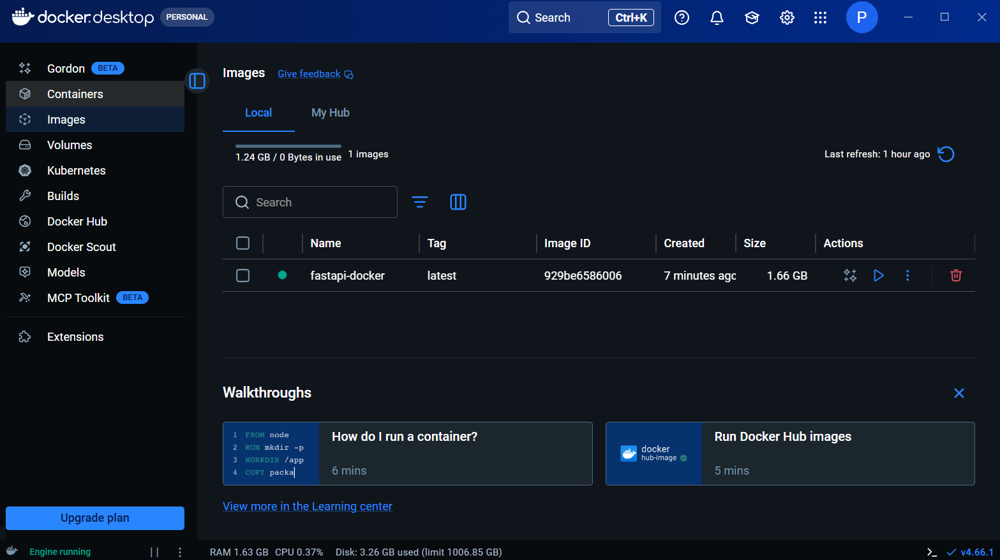
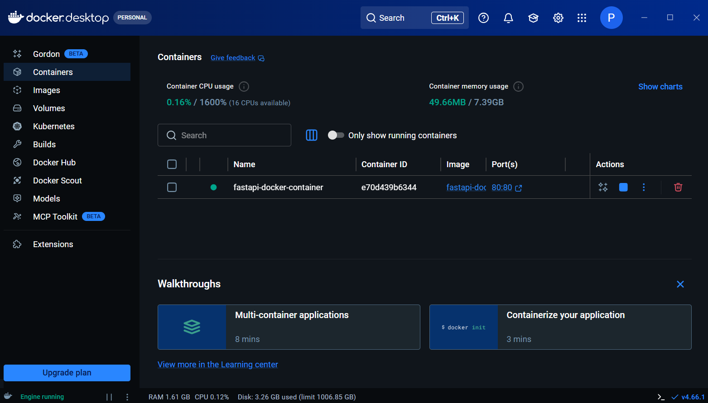
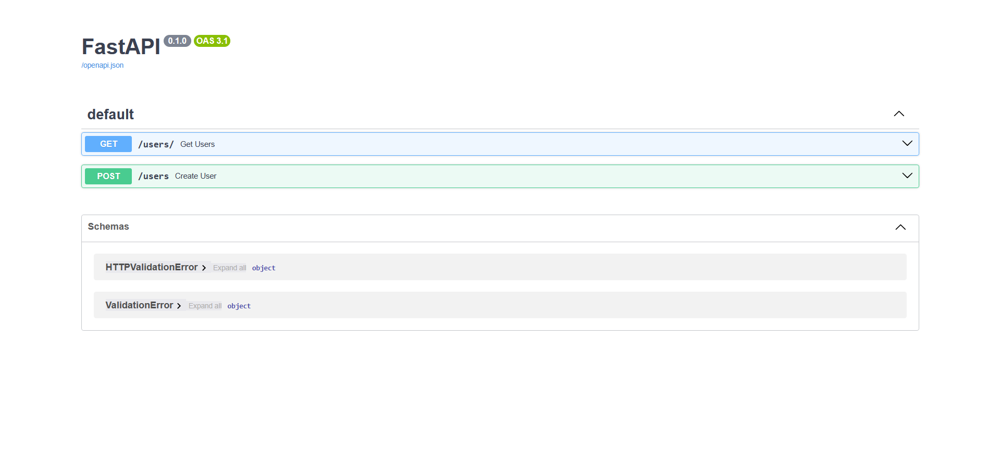
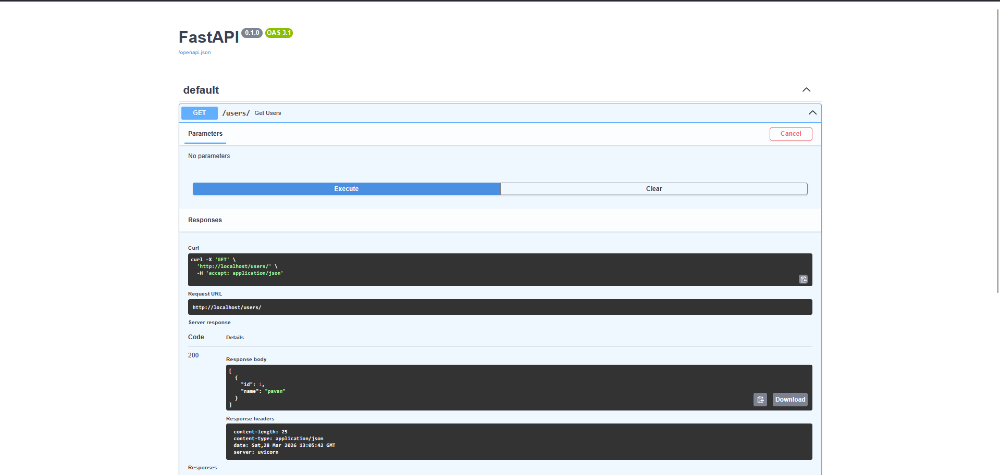

# 🐳 FastAPI + Docker

A beginner-friendly project demonstrating how to containerize a **FastAPI** application with **Docker**. Includes a SQLite database, background tasks, and a full Docker build and run workflow.

---

## 📸 Screenshots

### Docker Desktop — Image Created


### Docker Desktop — Container Running


### FastAPI — Swagger UI


### API Response


---

## ✨ Features

- ⚡ **FastAPI** — modern, fast Python web framework
- 🗃️ **SQLite + SQLAlchemy** — lightweight database with ORM
- 🔄 **Background Tasks** — async task execution after a response
- 🐳 **Dockerized** — fully containerized with a clean Dockerfile
- 📦 **uv inside Docker** — fast dependency installation in the container

---

## 🧰 Tech Stack

| Technology | Purpose |
|---|---|
| [FastAPI](https://fastapi.tiangolo.com/) | Web framework |
| [SQLAlchemy](https://www.sqlalchemy.org/) | ORM and database layer |
| SQLite | Lightweight database |
| [Docker](https://www.docker.com/) | Containerization |
| [uv](https://github.com/astral-sh/uv) | Fast package installer (used inside Docker) |
| [Uvicorn](https://www.uvicorn.org/) | ASGI server |

---

## 📁 Project Structure

```
fastapi-docker/
│
├── app/
│     └── main.py         # FastAPI application
│
├── Dockerfile            # Docker build instructions
├── requirements.txt      # Python dependencies
└── README.md
```

---

## ⚙️ Local Setup (Without Docker)

### 1. Create and activate a virtual environment

```bash
python -m venv venv
venv\Scripts\activate       # Windows
source venv/bin/activate    # macOS / Linux
```

### 2. Install dependencies

```bash
pip install fastapi sqlalchemy uvicorn
pip freeze > requirements.txt
```

### 3. Run the app locally

```bash
uvicorn app.main:app --reload
```

Open: [http://127.0.0.1:8000/docs](http://127.0.0.1:8000/docs)

---

## 🐍 Application Code

### `app/main.py`

```python
from typing import Annotated
from fastapi import FastAPI, BackgroundTasks, Depends
from sqlalchemy import create_engine, Column, Integer, String
from sqlalchemy.ext.declarative import declarative_base
from sqlalchemy.orm import sessionmaker, Session

app = FastAPI()

DATABASE_URL = "sqlite:///./test.db"

engine = create_engine(DATABASE_URL, connect_args={"check_same_thread": False})
session = sessionmaker(autocommit=False, autoflush=False, bind=engine)
Base = declarative_base()


def get_db():
    db = session()
    try:
        yield db
    finally:
        db.close()


db_dependency = Annotated[Session, Depends(get_db)]


class User(Base):
    __tablename__ = "users"
    id   = Column(Integer, index=True, primary_key=True)
    name = Column(String, index=True, unique=True)


Base.metadata.create_all(bind=engine)


@app.get("/users/")
async def get_users(db: db_dependency):
    return db.query(User).all()


@app.post("/users")
async def create_user(name: str, background_tasks: BackgroundTasks, db: db_dependency):
    user = User(name=name)
    db.add(user)
    db.commit()
    background_tasks.add_task(print_message, name)
    return {"name": name, "message": "User created successfully"}


async def print_message(name: str):
    print(f"user {name} created successfully")
```

---

## 🐳 Docker Setup

### Install Docker

1. Open **Microsoft Store**
2. Search for **Docker Desktop** and install it
3. Launch Docker Desktop and log in with your personal or business account
4. Wait for Docker to start (you'll see the whale icon in the taskbar)

---

### `Dockerfile`

```dockerfile
FROM python:3.12

WORKDIR /app

COPY requirements.txt .

# Install uv package manager
RUN pip install uv

# Install dependencies using uv (faster than pip)
RUN uv pip install --no-cache-dir -r requirements.txt

COPY ./app /app

CMD ["uvicorn", "main:app", "--host", "0.0.0.0", "--port", "80"]
```

**What each line does:**

| Line | Purpose |
|---|---|
| `FROM python:3.12` | Base image — Python 3.12 on Linux |
| `WORKDIR /app` | Set working directory inside the container |
| `COPY requirements.txt .` | Copy dependencies file into the container |
| `RUN pip install uv` | Install uv for fast package management |
| `RUN uv pip install ...` | Install all project dependencies |
| `COPY ./app /app` | Copy app code into the container |
| `CMD [...]` | Start the Uvicorn server on port 80 |

---

### Build and run the Docker container

> ⚠️ Delete the `venv` folder before building to keep the image clean.

```bash
# Build the Docker image
docker build -t fastapi-docker .

# Run the container
docker run -d --name fastapi-docker-container -p 80:80 fastapi-docker
```

**Flag explanation:**

| Flag | Meaning |
|---|---|
| `-d` | Run in detached mode (background) |
| `--name` | Give the container a name |
| `-p 80:80` | Map port 80 on your machine to port 80 in the container |

---

### Access the app

1. Open **Docker Desktop → Containers**
2. Find `fastapi-docker-container`
3. Click the **port link** (`:80`) to open the app in your browser
4. Go to `/docs` to access the interactive Swagger UI

---

### Stop the container

- In **Docker Desktop → Containers**, click the **Stop** button next to `fastapi-docker-container`

Or via terminal:

```bash
docker stop fastapi-docker-container
```

---

## 🛣️ API Routes

| Method | Route | Description |
|--------|-------|-------------|
| GET | `/users/` | Get all users from the database |
| POST | `/users?name={name}` | Create a new user |

### Example

```bash
# Create a user
POST http://localhost/users?name=Alice

# Get all users
GET http://localhost/users/
```

---

## 🔄 How Background Tasks Work

When a user is created, the API immediately returns a response and then runs `print_message()` in the background — without making the client wait.

```python
background_tasks.add_task(print_message, name)
```

This is useful for sending emails, logging, or any slow operation that doesn't need to block the response.

---

## ❓ Troubleshooting

| Problem | Fix |
|---|---|
| Docker Desktop not starting | Make sure virtualization is enabled in BIOS |
| Port 80 already in use | Change `-p 80:80` to `-p 8080:80` and access via `localhost:8080` |
| Container exits immediately | Run `docker logs fastapi-docker-container` to see the error |
| `venv` included in image | Delete the `venv` folder before running `docker build` |
| Changes not reflected | Rebuild with `docker build -t fastapi-docker .` after any code change |

---

## 📚 What You Learn From This Project

- Setting up a FastAPI app with SQLAlchemy and SQLite
- Using dependency injection with `Depends` in FastAPI
- Running background tasks after an API response
- Writing a `Dockerfile` to containerize a Python app
- Using `uv` inside Docker for faster dependency installation
- Building and running Docker containers from the command line
- Managing containers with Docker Desktop